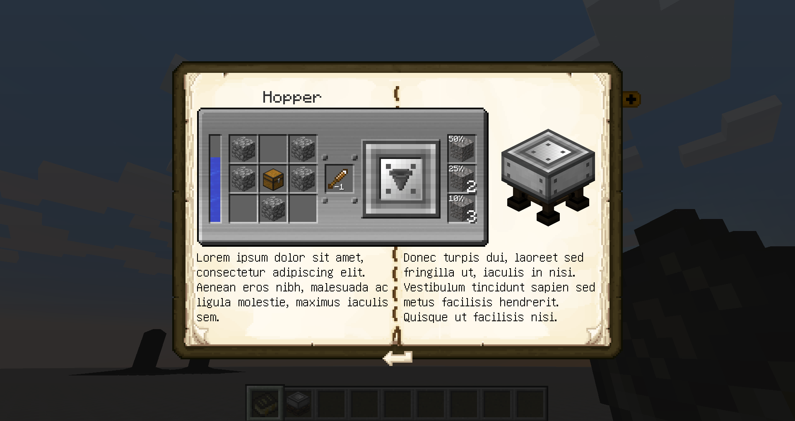
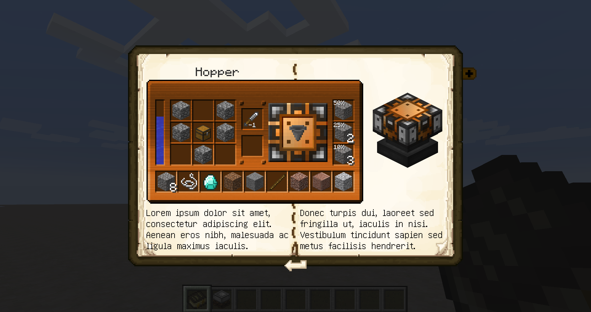
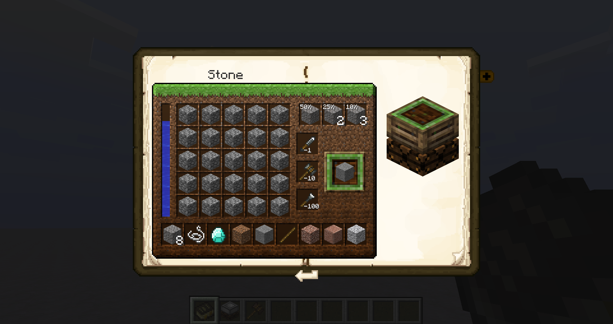

# Patchouli

Artisan Integrations exposes three Patchouli templates: `worktable`, `workstation`, and `workshop`.

The default item name header can be overridden for all templates by supplying a value for `header`.

---

## Worktable



```json
{
  "name": "Worktable Entry",
  "icon": "minecraft:writable_book",
  "category": "test_category",
  "pages": [
    {
      "type": "artisanintegrations:worktable",
      "recipe": "blacksmith:worktable_recipe",
      "text_left": "Lorem ipsum dolor sit amet, consectetur adipiscing elit. Aenean eros nibh, malesuada ac ligula molestie, maximus iaculis sem.",
      "text_right": "Donec turpis dui, laoreet sed fringilla ut, iaculis in nisi. Vestibulum tincidunt sapien sed metus facilisis hendrerit. Quisque ut facilisis nisi."
    },
    {
      "type": "text",
      "text": ""
    }
  ]
}
```

---

## Workstation



```json
{
  "name": "Workstation Entry",
  "icon": "minecraft:writable_book",
  "category": "test_category",
  "pages": [
    {
      "type": "artisanintegrations:workstation",
      "recipe": "engineer:workstation_recipe",
      "text_left": "Lorem ipsum dolor sit amet, consectetur adipiscing elit. Aenean eros nibh, malesuada ac ligula maximus iaculis.",
      "text_right": "Donec turpis dui, laoreet sed fringilla ut, iaculis in nisi. Vestibulum tincidunt sapien sed metus facilisis hendrerit."
    },
    {
      "type": "text",
      "text": ""
    }
  ]
}
```

---

## Workshop



```json
{
  "name": "Workshop Entry",
  "icon": "minecraft:writable_book",
  "category": "test_category",
  "pages": [
    {
      "type": "artisanintegrations:workshop",
      "recipe": "farmer:workshop_recipe"
    },
    {
      "type": "text",
      "text": ""
    }
  ]
}
```